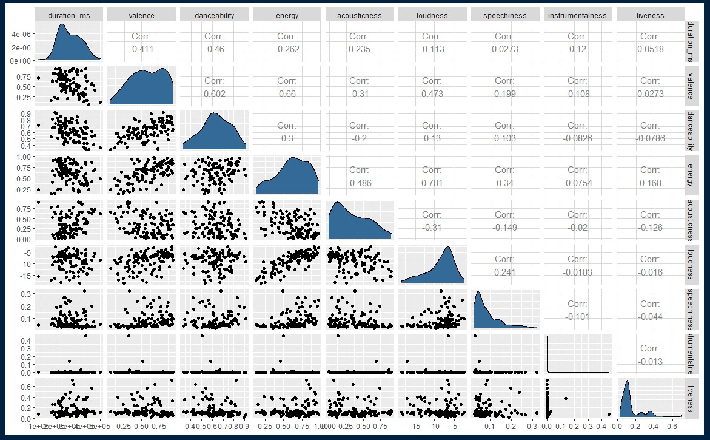
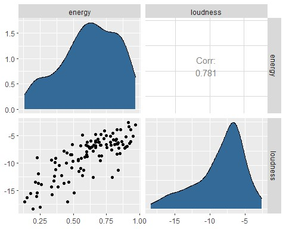

# Spotify-Artist-Analysis

## I. Introduction
In this study of Spotify Artists, I am choosing “Avadhoot Gupte” as the study artist because I am a big fan of him & his rock songs. Avadhoot Gupte is an Indian music composer and singer who is popularly known for his work in the Marathi film and music industry. His songs generally tend to be loud, energetic, and high-pitched yet melodious. Hence, I expect the same from the statistical analysis on the data as performed further.

## II. Exploratory Data Analysis

From the above graph and correlation matrix, we can say that the attributes ‘energy’ & ‘loudness’ have a high linear correlation. Thus, we will be going forward with those 2 attributes.

The plot suggests that the two variables are almost normally distributed. Using the QQ plot, it can be concluded that the Energy variable is more normal as compared to the Loudness variable.

Also, as mentioned previously that this artist has high energetic songs, this is reflected in the density plot of the energy where the plot tends to be left-skewed (dense towards the right-hand side where the energy is more). On similar lines, loudness also follows the same trend of being left-skewed. This pattern between energy and loudness is rightly anticipated as more the energy more will be the loudness. Hence, these numerical measurements match up with my opinions about the artist.

## III. Statistical Analysis
#### 1. Confidence Intervals of 'Energy' and 'Loudness'
> [1] 0.5705923 0.6655841 

> attr(,"conf.level") 

> [1] 0.99 ## [1] -9.362246 -7.803519 

> attr(,"conf.level") 

> [1] 0.99

The confidence intervals of energy lie between 0.5738 to 0.67208. This goes according to the trend about the artist where his songs tend to be more energetic. Hence, the confidence interval lies above 50% of the entire energy range(0 to 1). Also, the confidence interval of loudness ranges from -9.3768 to -7.7566, which suggests that the majority of the songs are loud enough. Hence they lie on the upper loudness band on the scale of -60 to 0 dB.

These numbers are also evident from the above density plot, therefore these confidence intervals describe the overall nature of the artist’s music.

#### 2. Two-sample Hypothesis Test on 'Energy'

>  Welch Two Sample t-test  

>  data: major_data and minor_data 

>  t = -0.3567, df = 56.137, p-value = 0.7227 

>  alternative hypothesis: true difference in means is not equal to 0 

>  99 percent confidence interval: 

>  -0.12795400 0.09775792 

>  sample estimates: 

>  mean of x mean of y 

>  0.6143137 0.6294118

The p-value of the Welch Two Sample t-test states that we do not have enough evidence to reject the null hypothesis. Thus, we accept the null hypothesis where the means of the two groups are the same/similar (Significant level = 0.01). This is also evident from the fact that the energy of the song would not have much impact on the song modality (ie. melodic content). Tracks with Major mode (such as Celebrations, Happy songs) have both high and low energy. This is similar to the Minor mode songs (Eg. – Sorowful songs) where both energy levels are prevalent. Hence, the means of the two-mode groups almost overlap with each other implying that the energy distributions of the two modes follow the same/similar distribution (irrespective of the mode).

#### 3. ANOVA & Pairwise Hypothesis Test
>  Analysis of Variance Table  

>  Response: loudness 

>  Df Sum Sq Mean Sq F value Pr(>F) 

>  album_name 13 855.98 65.845 10.33 2.048e-14 

>  Residuals 122 777.67 6.374 

>  --- 

>  Signif. codes: 0 0.001 0.01 0.05 '.' 0.1 ' ' 1

The ANOVA test on the loudness parameter with respect to album name says that there is at least 1 pair of albums which have different sample means ie. not all albums follow the null hypothesis (ie. two means are not equal). This can be concluded by observing the p-value = 1.899e-14. This provides significant evidence that not all means are equal. Hence, we statistically reject the Null hypothesis (Significance Level = 0.01).

From the above graph and Tukey HSD (Honestly Significant Difference) test results, states that there are certain albums whose sample means are the same/similar and thus tend to overlap. On the other hand, there are certain albums whose means are much far away and thus have lesser p-values.

These results make sense because not all albums have the same loudness levels. There are certain albums that are totally loud (such as Aala Maharaja, Morya, Party Songs, etc.) whereas there is another category of albums that are relatively less loud (such as Paus, Tujhi Athwan, Mazhi Gani, etc.). The p-value of two means of polar loudness categories would be nearly 0 (Eg. p-value between Aala Maharaja & Mazhi Gani is 0.0000012), thus rejecting the null hypothesis. Conversely, the p-value of the same/similar loudness category albums has relatively higher p-values (Eg. p-value of Morya & Aala Maharaja is 0.9928106), thus accepting the null hypothesis. These observations are as per the expectations and hence makes a lot of sense.

#### 4. Linear Regression
Now, we fit a linear model of energy Vs. loudness. We expect the relationship to be positively linear, which means that as the energy increases loudness also increases. I felt that ‘energy’ is the independent variable and ‘loudness’ is the dependent variable since the energy level of the song decides its loudness. Hence, I chose predictor & response variables as ‘energy’ & ‘loudness’ respectively.

##### a. Scatterplot of the variables with the correlation between them

The variables energy & loudness follow the positive linear trend with some noise around the regression line. Thus, the correlation between them is 0.78, which is higher (ie. near to 1).

##### b. Fitting linear regression model and interpreting the slope & intercept 
>  Call: 

>  lm(formula = loudness ~ energy, data = data)  

>  Residuals: 

>  Min 1Q Median 3Q Max 

>  -6.4248 -1.2854 0.2168 1.5417 4.5619  

>  Coefficients: 

>  Estimate Std. Error t value Pr(>|t|) 

>  (Intercept) -16.5073 0.5779 -28.57 <2e-16 

>  energy 12.8208 0.8847 14.49 <2e-16 

>  ---

>  Signif. codes: 0 0.001 0.01 0.05 '.' 0.1 ' ' 1 

>  

>  Residual standard error: 2.179 on 134 degrees of freedom 

>  Multiple R-squared: 0.6105, Adjusted R-squared: 0.6076 

>  F-statistic: 210 on 1 and 134 DF, p-value: < 2.2e-16

From the above results, we can interpret that the slope of the linear equation is 12.8208, and the intercept is -16.5073. Thus, the linear equation is –

> y_hat = (12.8208 * x) - 16.5073

The y-intercept & slope of the line is the parameters used for fitting the line well according to the data by minimizing the Sum of Squared Errors (SSE). The slope does not make sense as both the variables used are not scaled on the same scale. Thus, scaling will change the slope of the line. Also, the y-intercept suggests that even when energy is 0, loudness would be -16.5073 (which would be impractical). Hence, these parameters are subjective to the line fitting for the data.

##### c. Performing hypothesis test to test whether ‘energy’ is the good predictor
>  Welch Two Sample t-test  

>  data: data$loudness and pred_loudness 

>  t = -1.4078e-14, df = 255.08, p-value = 1 

>  alternative hypothesis: true difference in means is not equal to 0 

>  99 percent confidence interval: 

>  -0.9824214 0.9824214 

>  sample estimates: 

>  mean of x mean of y 

>  -8.582882 -8.582882

The above t-test results with p-value = 1 suggest that the actual and predicted values of the loudness variable follow the same distribution. This provides the strong evidence that the two means are equal and we accept the null hypothesis. Hence, the predictor variable ‘energy’ is a good predictor in the linear model.

##### d. Predictions at 20th, 40th, 60th & 80th predictor values
>  energy loudness_predictions 

>  20% 0.445 -10.802013 

>  40% 0.588 -8.968638 

>  60% 0.693 -7.622453 

>  80% 0.826 -5.917286

The above table summarizes predicted loudness values for each percentile values of energy. From the table, we can observe that as the percentile increases energy value also increases with an increase in loudness predictions. This is because of the positive correlation between the variables: energy and loudness.

##### e. Checking the regression assumptions
###### i) Normality of the residuals

From the QQ-plot, we can interpret that the residuals are normally distributed. There is some deviation at the tails, but that’s expected. Essentially there is not much of a pattern to the deviation from the line except for the tails. Hence, the residuals of our linear model follow the normality assumption.

###### ii) Assessing Mean & Variance of the residuals

The errors are normally distributed and thus the scatter plot has points homogenously distributed along the horizontal line (homoscedastic). Also, the red line almost follows the black line which means that the mean is approximately 0 across the regression line. Also, the plot does not showcase much larger deviations which indicates that the variance is constant across the whole plot.
Thus, we can confidently say that the linear model fitted using ‘energy’ and ‘loudness’ is valid based on the statistical inferences derived from the assumptions of the residuals.

From the above “Residuals vs Leverage” plot, we can say that both residuals and leverage are low and thus the model fits well with the predictor variable ‘energy’ in order to predict the dependent variable ‘loudness’.

## IV. Conclusion
In this study, we analyzed different parameters of the Spotify data for the artist “Avadhoot Gupte” and we found that attributes ‘energy’ & ‘loudness’ have the largest linear correlation. By knowing the artist, I can say that most of the songs in his albums are rock songs and thus have high energy & loudness. The results found out from different tests in this study are in line with our expectations. We observed that there is a positive linear relationship between energy and loudness. Moreover, the energy & loudness concentrate more towards the upper extremes values (indicating higher energy & loudness levels). This is also evident from the confidence intervals of the two variables.
It is also observed that the energy remains unchanged irrespective of the modes in the albums. However, the loudness levels change with the change in album names because all albums do not have uniform loudness levels. Some albums are comparatively louder than the rest of the albums. The Linear relation perfectly predicts the loudness levels using the predictor variable energy. Hence, the linear model used is valid and predictors are good in predicting the results with minimal errors.